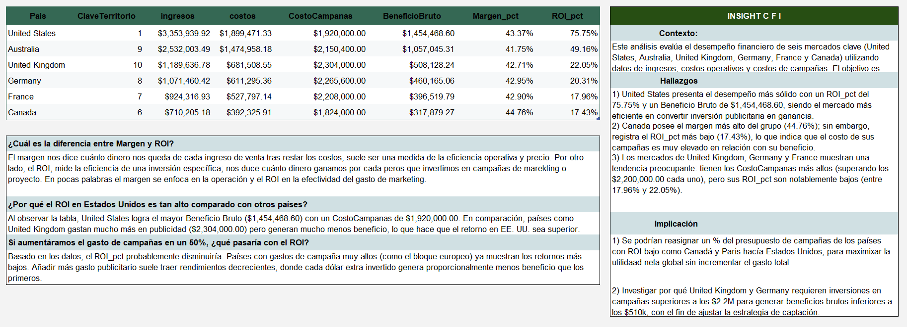

# Global Financial Performance & Marketing ROI Audit 💰📈

## 📝 Context & Objective
Este análisis evalúa el desempeño financiero de seis mercados clave (**United States, Australia, United Kingdom, Germany, France y Canada**) utilizando datos de ingresos, costos operativos y costos de campañas. El objetivo es determinar la eficiencia del gasto en marketing y la rentabilidad neta mediante las métricas de **Margen_pct** y **ROI_pct**.

## 🛠 Methodology
- **SQL:** Extracción y consolidación de métricas financieras.
- **Data Analysis:** Cálculo de ratios de rentabilidad y retorno de inversión.
- **Visualization:** Creación de un Dashboard ejecutivo para la toma de decisiones.

## 📊 Findings (Hallazgos Clave)
Basado en el análisis de los datos consolidados:
- **Líder en Eficiencia:** **United States** logra el mayor Beneficio Bruto ($1,454,468.60) con un ROI del **75.75%**, siendo el mercado más rentable.
- **Punto Crítico en Europa:** Los mercados de **United Kingdom, Germany y France** muestran una tendencia preocupante: tienen los costos de campaña más altos (superando los $2.2M cada uno), pero sus retornos (ROI) son notablemente bajos (entre 17.96% y 22.05%).
- **Anomalía de Gasto:** United Kingdom gasta mucho más en publicidad ($2,304,000.00) que EE. UU., pero genera mucho menos beneficio bruto.

## 💡 Business Recommendations (Implicaciones)
1. **Reasignación Estratégica:** Reasignar un porcentaje del presupuesto de campañas de países con ROI bajo (como Canadá y Francia) hacia **United States**, para maximizar la utilidad neta global sin incrementar el gasto total.
2. **Auditoría de Inversión:** Investigar por qué United Kingdom y Germany requieren inversiones superiores a los $2.2M para generar beneficios inferiores a los mercados más eficientes.
3. **Optimización de Retornos:** Se recomienda no incrementar el gasto en el bloque europeo actualmente, ya que añadir más gasto publicitario en mercados saturados suele traer rendimientos decrecientes.

---
### 🖥️ Dashboard Preview
 

---
**File:** `Proyecto 3_ Análisis del desempeño financiero con SQL - Resumen ejecutivo (2)`
